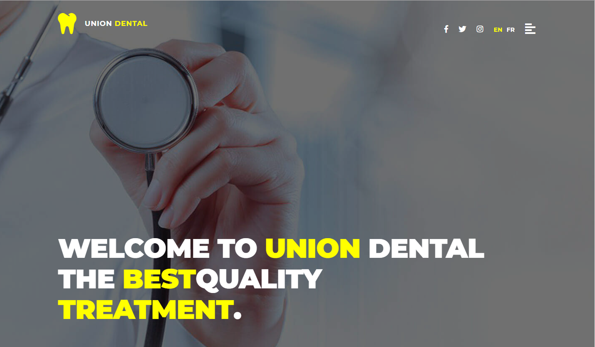

# Dental clinic

A Node app built with MongoDB (Mongoose) React and Redux for learning MERN stack purpose. 

Node provides the RESTful API, React provides the frontend and accesses the API, Redux for state management and MongoDB as a realtime database.

# Getting started

To get the APP running locally:

Make sure you have Node.js and MongoDB Community Edition ([instructions](https://docs.mongodb.com/manual/installation/#tutorials)) installed.

- Clone this repo
- `npm install` to install all required dependencies
- Run `mongod`
- `npm run start` to start the local server

The APP should now be running on localhost:8000.

# Contribution

This repo is functionality not complete - PRs and issues welcome!
